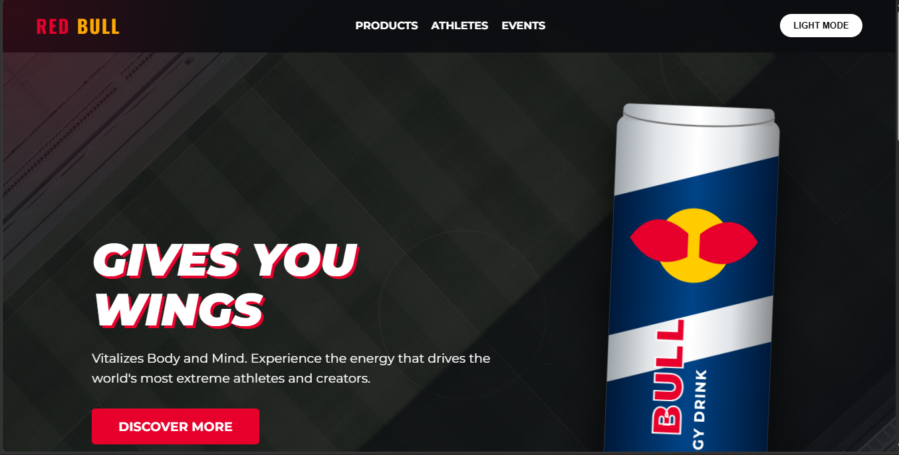

# 🚀 Red Bull Interactive Landing Page Concept

A highly interactive, responsive, and fully vanilla frontend landing page concept designed for Red Bull. This project demonstrates advanced CSS animations, 3D transformations, and DOM manipulation without relying on external libraries.

## ✨ Live Demo
http://127.0.0.1:5500/index.html

## 🎯 Features

This landing page includes **6 unique interactive features** to provide an extreme, high-energy user experience:

1. **🌗 Dark / Light Mode Toggle**: Seamlessly transition between a sleek dark theme and a vibrant light theme using CSS Variables and JavaScript.
2. **🔦 Cursor-Following Spotlight**: A dynamic, translucent radial gradient that follows the user's mouse pointer across the screen.
3. **🧊 3D Interactive Hover Effects**: The product cards feature a perspective-based 3D tilt effect that responds exactly to the X and Y coordinates of the user's cursor.
4. **📜 Scroll Animations**: Elements smoothly fade and slide into view as the user scrolls down the page, powered by the `IntersectionObserver` API.
5. **🌌 Parallax Background Effect**: The hero background image moves at a slightly slower speed than the foreground content, creating a subtle illusion of depth.
6. **⏱️ Functional Event Countdown**: A live, ticking countdown timer built with JavaScript Date objects, set to an upcoming extreme event.

## 🛠️ Built With

* **HTML5**: Semantic and accessible markup.
* **CSS3**: Variables, Flexbox, Animations (`@keyframes`), Transforms (3D Perspective), Filters (`hue-rotate`, `drop-shadow`), and Media Queries.
* **Vanilla JavaScript (ES6)**: DOM manipulation, Event Listeners, Math calculations (for 3D tilt), `IntersectionObserver`, and `setInterval`.
* **Scalable Vector Graphics (SVG)**: Custom-built, inline SVG implementation for the Red Bull cans.

## 💡 The "Zero-Error" SVG Solution

To prevent cross-origin resource sharing (CORS) errors, broken image links, or hotlinking blocks common with copyrighted assets, the Red Bull cans in this project are built entirely using **Inline SVGs**. 

* **Why?** It guarantees 100% loading reliability, infinite scalability without pixelation, and instant rendering.
* **Dynamic Styling**: By utilizing the CSS `filter` property (specifically `hue-rotate` and `saturate`), the "Sugarfree" and "Tropical" edition cans are dynamically generated from a single base SVG structure, keeping the codebase DRY (Don't Repeat Yourself).

## Name :- Piyush Kumar Dash
## Registration Number:- 25BAI10103

